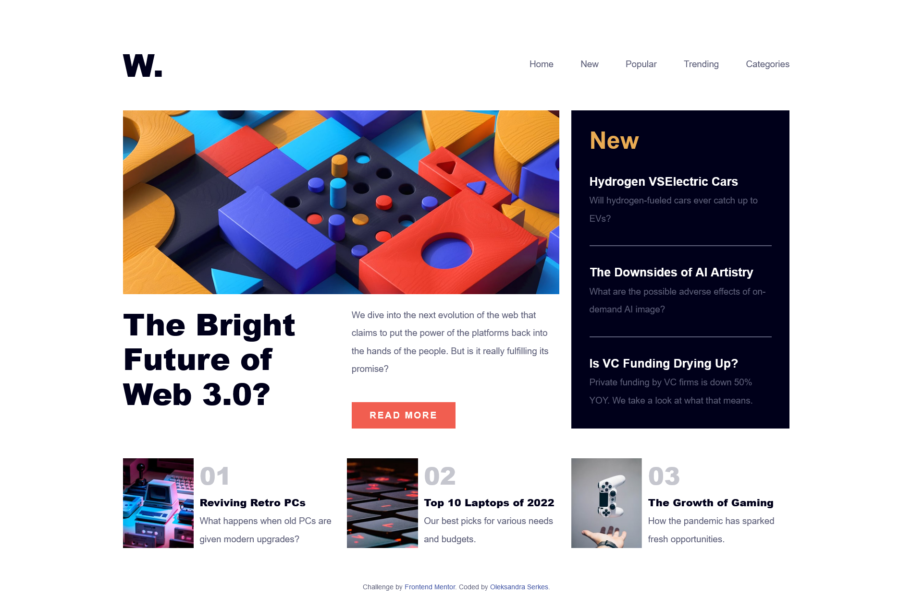
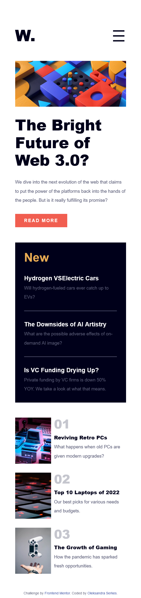

# Frontend Mentor - News homepage solution

This is a solution to the [News homepage challenge on Frontend Mentor](https://www.frontendmentor.io/challenges/news-homepage-H6SWTa1MFl). Frontend Mentor challenges help you improve your coding skills by building realistic projects.

## Table of contents

- [Overview](#overview)
  - [The challenge](#the-challenge)
  - [Screenshot](#screenshot)
  - [Links](#links)
- [My process](#my-process)
  - [Built with](#built-with)
  - [What I learned](#what-i-learned)
  - [Continued development](#continued-development)
- [Author](#author)

## Overview

### The challenge

Users should be able to:

- View the optimal layout for the interface depending on their device's screen size
- See hover and focus states for all interactive elements on the page

### Screenshot

Design desctop preview for the News homepage coding challenge


Design mobile preview for the News homepage coding challenge


### Links

- Solution URL: [GitHub Pages](https://github.com/OlSerkes/news-homepage-main)
- Live Site URL: [News homepage](https://olserkes.github.io/news-homepage-main/)

## My process

### Built with

- Semantic HTML5 markup
- CSS custom properties
- Flexbox
- CSS Grid
- Mobile-first workflow
- JavaScript

### What I learned

I learned how to use CSS Grid for the blocks whith different sizes and types of content. I proud of my modal window for the mobile menu, especial using CSS animation.

```html
<div class="main__box">
  <div class="main__img">
    
  </div>
  <div class="info__box">
    <div class="info__box-title" id="new">New</div>
    <div class="info__box-item">
      <a class="info__box-item-title" href="#">Hydrogen VSElectric Cars</a>
      <p class="info__box-item-text">
        Will hydrogen-fueled cars ever catch up to EVs?
      </p>
    </div>
    <hr />
    <div class="info__box-item">
      <a class="info__box-item-title" href="#">The Downsides of AI Artistry</a>
      <p class="info__box-item-text">
        What are the possible adverse effects of on-demand AI image?
      </p>
    </div>
    <hr />
    <div class="info__box-item">
      <a class="info__box-item-title" href="#">Is VC Funding Drying Up?</a>
      <p class="info__box-item-text">
        Private funding by VC firms is down 50% YOY. We take a look at what that
        means.
      </p>
    </div>
  </div>
  <article class="main__box-article">
    <div class="main__box-title">
      <h1 class="title">The Bright Future of Web 3.0?</h1>
    </div>
    <div class="main__box-text">
      <p class="main__box-text-item">
        We dive into the next evolution of the web that claims to put the power
        of the platforms back into the hands of the people. But is it really
        fulfilling its promise?
      </p>
      <div class="main__box-button">
        <a class="button" href="#">Read more</a>
      </div>
    </div>
  </article>
</div>
```

```css
.modal__container {
  background-color: #fffdfa;
  display: block;
  position: fixed;
  top: 0;
  left: 165px;
  right: 0;
  bottom: 0;
  z-index: 2;
  transform: translateX(0%);
  transition: opacity 0.5s ease-in-out, transform 0.5s ease-in-out;
}
.overlay {
  position: fixed;
  top: 0;
  bottom: 0;
  left: 0;
  right: 0;
  width: 100%;
  height: 100%;
  background: #00001a;
  opacity: 0.8;
  z-index: 1;
  transition: opacity 0.5s ease-in-out;
}

.hidden {
  opacity: 0;
  transform: translateX(100%);
  transition: opacity 0.5s ease-in-out, transform 0.5s ease-in-out;
}
```

### Continued development

I will continue focusing on CSS Grid layouts and CSS animation for using it in my future projects. I want to refine and perfect it.

## Author

- Website - [Oleksandra Serkes](https://github.com/OlSerkes)
- Frontend Mentor - [@OlSerkes](https://www.frontendmentor.io/profile/OlSerkes)
- Linkedin - [Oleksandra Serkes](https://www.linkedin.com/in/oleksandra-serkes-65580620a/)
